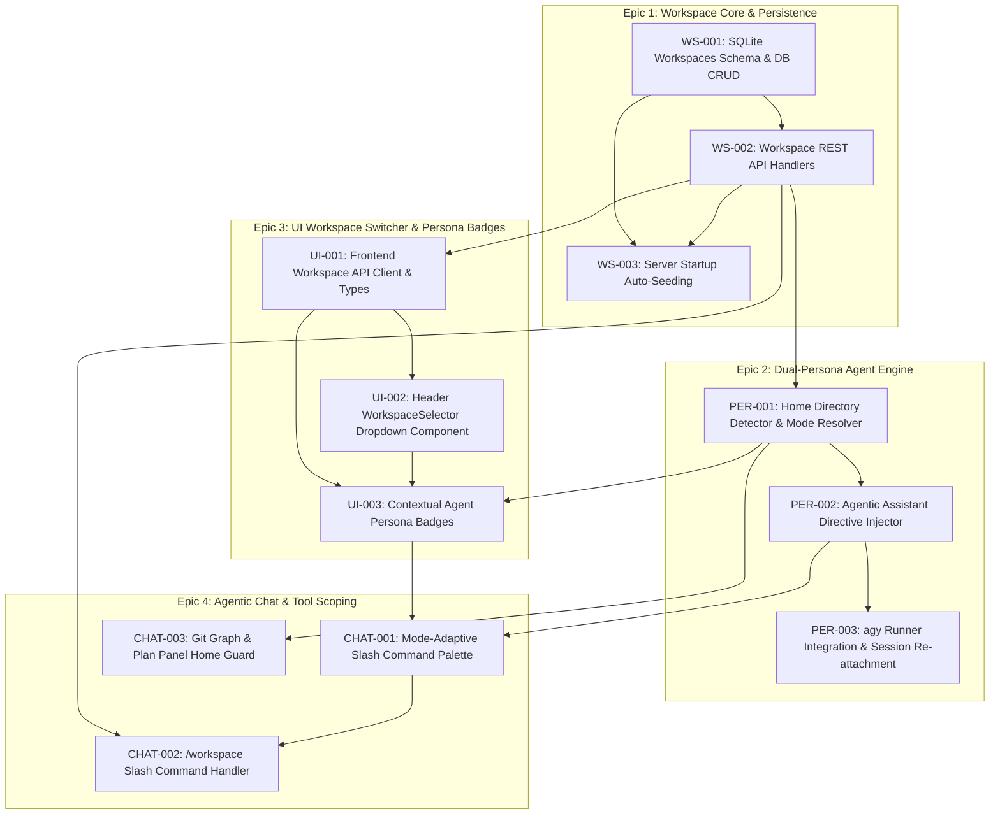

# AGY Online — Master Ticket Backlog: Workspace Management & Dual-Persona Agent

**Dokumen Induk:** [docs/PRD.md](../PRD.md) | [AGENTS.md](../../AGENTS.md) | [GEMINI.md](../../GEMINI.md)  
**Tech Stack:** Go 1.27 (0 CGO, `creack/pty`, `coder/websocket`, `modernc.org/sqlite`) | React 18 + TypeScript + Zustand + Vite + Tailwind/Custom CSS  
**Total Epics:** 4 Epics  
**Total Actionable Tickets:** 11 Tickets  
**Estimasi Total Story Points:** 42 SP  

---

## 1. Peta Ketergantungan Antar Ticket (Dependency Graph)

---

## 2. Tabel Master Backlog Tiket (11 Tickets)

| ID Tiket | Epic | Judul Tiket | Prioritas | SP | Assignee Role | Status |
|---|---|---|---|---|---|---|
| [`WS-001`](./EPIC-1-WORKSPACE-CORE/WS-001-database-schema-workspaces.md) | Epic 1 | SQLite Workspaces Table Schema & DB CRUD Methods | P0 | 3 | Backend | **Done** |
| [`WS-002`](./EPIC-1-WORKSPACE-CORE/WS-002-workspace-rest-api-handlers.md) | Epic 1 | Workspace REST API Endpoints & Route Registration | P0 | 5 | Backend | **Done** |
| [`WS-003`](./EPIC-1-WORKSPACE-CORE/WS-003-server-initialization-seeding.md) | Epic 1 | Server Startup Workspace Auto-Seeding & Home Binding | P1 | 2 | Backend | **Done** |
| [`PER-001`](./EPIC-2-DUAL-PERSONA-ENGINE/PER-001-home-directory-detector.md) | Epic 2 | Home Directory Scoping & Runtime Mode Resolver | P0 | 3 | Backend / Core | **Done** |
| [`PER-002`](./EPIC-2-DUAL-PERSONA-ENGINE/PER-002-agentic-assistant-directive-engine.md) | Epic 2 | Contextual Agentic Assistant Directive Prompt Injector | P0 | 5 | AI Engine | **Done** |
| [`PER-003`](./EPIC-2-DUAL-PERSONA-ENGINE/PER-003-session-context-resumption-runner.md) | Epic 2 | agy Headless Runner Context Propagation & Session Re-attachment | P0 | 3 | AI Engine | **Done** |
| [`UI-001`](./EPIC-3-UI-WORKSPACE-SWITCHER/UI-001-frontend-workspace-api-client.md) | Epic 3 | Frontend Workspace API Client, Interfaces & State | P0 | 3 | Frontend | **Done** |
| [`UI-002`](./EPIC-3-UI-WORKSPACE-SWITCHER/UI-002-header-workspace-selector-dropdown.md) | Epic 3 | Header WorkspaceSelector Dropdown & Management Modal | P0 | 5 | Frontend | **Done** |
| [`UI-003`](./EPIC-3-UI-WORKSPACE-SWITCHER/UI-003-agent-persona-visual-badges.md) | Epic 3 | Contextual Persona Telemetry Badges (Assistant vs Coding) | P1 | 3 | Frontend | **Done** |
| [`CHAT-001`](./EPIC-4-AGENTIC-CHAT-INTEGRATION/CHAT-001-mode-adaptive-slash-palette.md) | Epic 4 | Mode-Adaptive Slash Command Autocomplete & Palette | P1 | 5 | Full-Stack | **Done** |
| [`CHAT-002`](./EPIC-4-AGENTIC-CHAT-INTEGRATION/CHAT-002-workspace-slash-command.md) | Epic 4 | `/workspace` Slash Command Execution & Navigation Handler | P1 | 3 | Full-Stack | **Done** |
| [`CHAT-003`](./EPIC-4-AGENTIC-CHAT-INTEGRATION/CHAT-003-git-plan-guard-in-home.md) | Epic 4 | Git Graph & Plan Panel Home Directory Graceful Guards | P2 | 2 | Frontend | **Done** |
